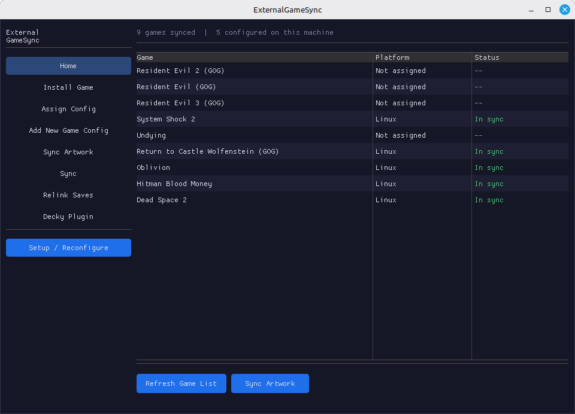
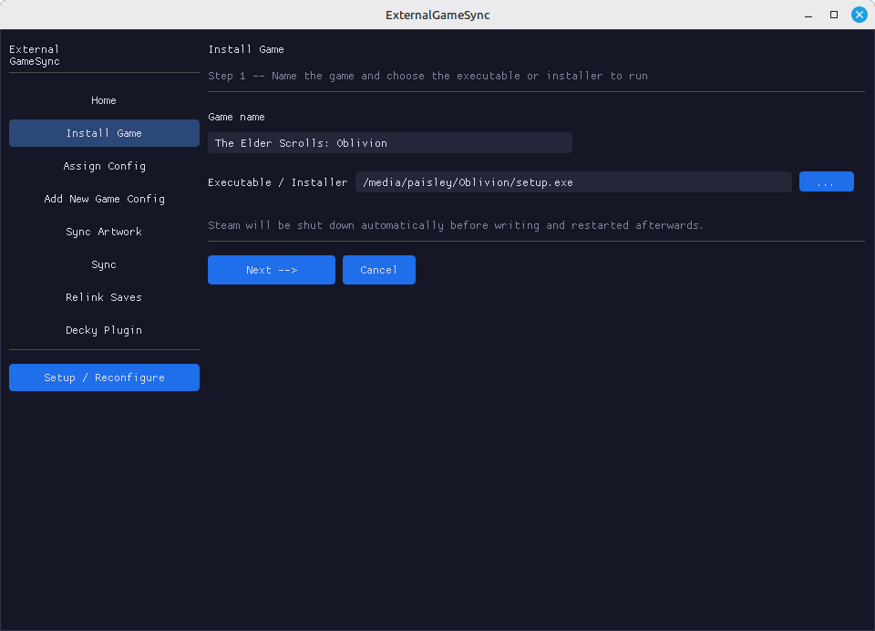
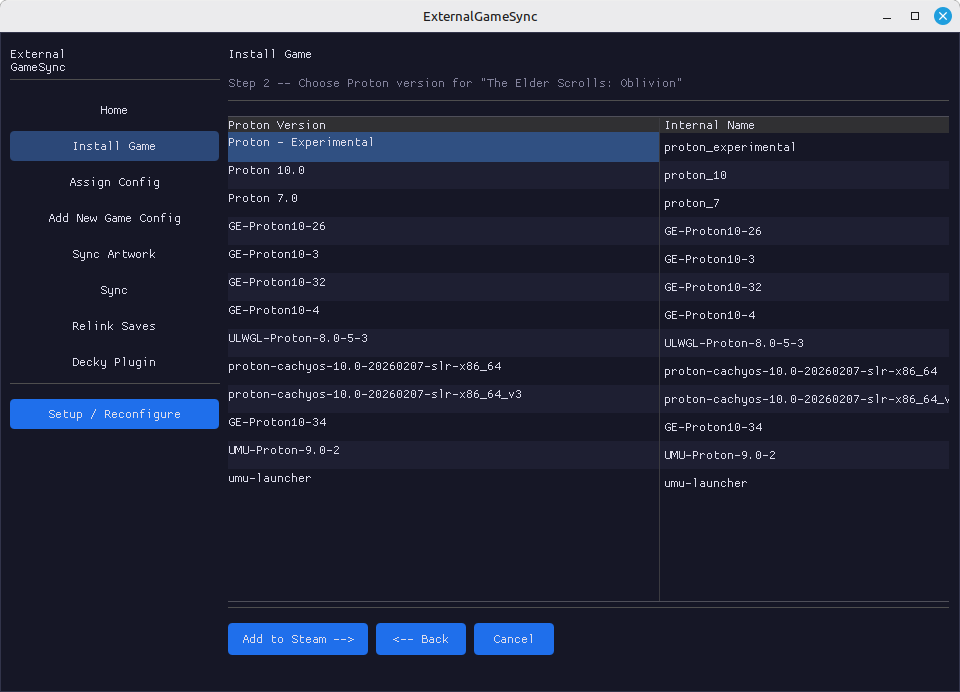

# ExternalGameSync



Keep your non-Steam game saves in sync across your PC and Steam Deck (or any mix of Windows and Linux machines), using your own cloud storage. No subscription, no third-party servers — your saves go directly to storage you already own or control.

ExternalGameSync handles the whole workflow: getting a Windows game running under Proton, setting up save syncing, and keeping everything up to date automatically every time you launch a game through Steam.

This project was developed with extensive AI assistance under my direction and review. Contributions, architecture decisions, and project design were curated by the maintainer.

---

## What it does

- **Automatic save sync on launch and exit** — before a game starts, the latest saves are pulled from the cloud; after you quit, they're pushed back. You just play; the syncing happens in the background.
- **Works with the cloud storage you already have** — supports Nextcloud, Owncloud, WebDAV servers, SFTP, and the major consumer cloud providers: Dropbox, Google Drive, and OneDrive.
- **Installs Windows games into Proton for you** — the GUI walks you through adding a game installer as a temporary Steam shortcut, running it through Proton, and then cleaning up the shortcut and setting up syncing. No manual shortcuts.vdf editing required.
- **Central game registry** — one `games.json` on your cloud storage holds the config for all your games, shared across every machine. Add a game once; assign it on other machines in a few clicks.
- **Conflict detection** — if you played on two machines without syncing, a fullscreen dialog with controller support asks which save to keep. Both sides are backed up first.
- **Steam artwork sync** — portrait, landscape, hero, logo, and icon art can be stored on the cloud and pulled automatically when assigning a game to a new machine.
- **Steam Deck Gaming Mode support** — a [Decky Loader](https://decky.xyz) plugin puts sync status and controls in the quick-access menu. Includes background polling and optional auto-pull when the cloud is ahead.

---

## Requirements

- Python 3.8+
- [rclone](https://rclone.org) (installer handles this)
- Python `vdf` and `dearpygui` packages (installer handles this)
- One of the supported cloud storage backends (see [Cloud storage setup](#1-cloud-storage-setup))

---

## Install

```bash
git clone https://github.com/pmahern/externalgamesync
cd externalgamesync
chmod 755 install.sh
bash install.sh
```

No root required. Everything installs to `~/.local/`.

---

## Quick start

```bash
externalgamesync gui
# or find "ExternalGameSync" in your app menu
```

---

## Setup walkthrough

### 1. Cloud storage setup

Open **Setup / Reconfigure** in the sidebar. Pick your provider and enter credentials:

| Provider | What you need |
|---|---|
| **Nextcloud** / **Owncloud** | WebDAV URL, username, password |
| **WebDAV (other)** | Server URL, username, password |
| **SFTP** | Host, port, username, password or key path |
| **Dropbox** | Click "Connect - opens browser" — authorize in your browser, then paste the code back |
| **Google Drive** | Same browser OAuth flow |
| **OneDrive** | Same browser OAuth flow |

The setup wizard creates and tests the rclone remote, then pulls `games.json` from the cloud (creating it if this is the first machine).

---

### 2. Getting a game into Steam / Proton (Linux)

Before syncing, the game needs to exist as a non-Steam shortcut so Proton can run it. If it's already in Steam, skip to step 3.

**Install Game** (sidebar) handles this end-to-end:



1. Enter a display name and browse to the Windows `.exe` installer for the game.



2. Pick the Proton version to use.

ExternalGameSync shuts Steam down, writes the shortcut and Proton mapping to `shortcuts.vdf` / `config.vdf`, then relaunches Steam and queues the installer to run automatically. Complete the installation — keep the default install folder to make things easier later.

On **Windows**, install the game normally first — run its installer, or install through GOG Galaxy, the Epic Games Launcher, or whichever store you bought it from. Once it's installed, add it to Steam manually (**Games → Add a Non-Steam Game to My Library**, then browse to the `.exe`), and continue to the next step.

---

### 3. Creating a sync config for a game

Use **Add New Game Config** (sidebar):

**Step 1 — Game type**
Choose how the game is installed:

- **Non-Steam Shortcut** — a game you added to Steam manually via Games > Add a Non-Steam Game. It runs in its own Proton prefix, separate from any Steam purchase.
- **Native Steam Game** — a game you bought on Steam that lacks working cloud saves (e.g. Dead Space 2). It uses the game's own Steam App ID and Proton prefix. After selecting this path, pick the game from the list of installed Steam games.

> **Steam Cloud conflict warning (native Steam only)**
> If the game has any Steam Cloud support at all, ExternalGameSync and Steam Cloud managing the same saves will cause conflicts on every launch. Before continuing, disable Steam Cloud for the game: right-click in Steam > Properties > General, then uncheck "Keep game saves in the Steam Cloud."

**Step 2 — Name and prefix / App ID**
Confirm or edit the display name.
- *Non-Steam shortcut*: on Linux, the GUI tries to auto-detect the correct Proton prefix (App ID) from the shortcut's exe path — you can also pick it from the list of installed prefixes. Prefixes are listed newest first, so a freshly installed game should be at the top.
- *Native Steam game*: the App ID is shown read-only (it's the game's real Steam App ID); no prefix selection needed.

**Step 3 — Find in game database (optional)**
Search the ludusavi community manifest for auto-detected save paths (see [Ludusavi manifest integration](#ludusavi-manifest-integration) below).

**Step 4 — Paths and options**

| Field | What to enter |
|---|---|
| Executable | The main game `.exe`. For non-Steam shortcuts on Linux, browse inside the Proton prefix — the GUI opens directly in `Program Files`. For native Steam games on Linux, the exe is provided by Steam at launch and no path is needed. |
| Save folder | The folder that holds save files. On Linux, browse inside the Proton prefix — the GUI opens in `AppData/Roaming`. It's OK if the folder doesn't exist yet; it will be created the first time you save. Check PCGamingWiki if unsure. |
| Env vars | Optional environment variables for launch (e.g. `DXVK_ASYNC=1`). Linux only. |
| Save filter | Optional rclone glob to sync only part of the save folder. Leave blank to sync the entire folder. |
| Disc image | Optional path to an `.iso` to auto-mount via udisksctl before launch and unmount after. Useful for older games that check for a disc — the original Elder Scrolls: Oblivion is one example. |

**When to use Save filter**

Some games store saves inside their own install folder, alongside executables and data files. System Shock 2 (GOG) is a real example: each save slot is a subfolder named `save_0`, `save_1`, etc. inside the game root. Its config:

```
save_path:   GOG Games/System Shock 2
save_filter: save_*/**
```

Setting the save folder to the game root without a filter would sync hundreds of megs of game data on every launch. The filter `save_*/**` tells rclone to only transfer files inside folders whose names start with `save_`.

Clicking **Configure** will:
- Save the game config to `games.json` and push it to cloud storage
- Create the save symlink in `~/ExternalGameSync/saves/<game_id>/` (Linux)
- Run an initial pull + push to establish the baseline
- Rewrite the Steam shortcut's Launch Options (non-Steam shortcut) or the game's Steam Launch Options (native Steam) to use the sync wrapper and pre-launcher

Restart Steam when prompted for the Launch Options change to take effect.

---

### 4. Assigning the same game on another machine

On the second machine, run setup if you haven't already (step 1), then use **Assign Config** (sidebar):

**Step 1 — Pick game**
The GUI lists all games from `games.json`. Use the search box to filter by name. Select the game you want to assign.

**Step 2 — Installation type**
Choose how the game is installed on this machine:

- **Non-Steam Shortcut** — if the game was added to Steam manually here. Select the matching shortcut from the list. If the game isn't in Steam yet, install it and add it as a non-Steam shortcut first (step 2 above).
- **Native Steam Game** — if the game is a Steam purchase on this machine too. The GUI shows your installed Steam games; select the matching entry to fill the App ID automatically, or type it in directly. The same Steam Cloud warning from step 3 applies — disable Steam Cloud for the game before proceeding.

**Step 3 — Confirm paths**
The GUI resolves exe and save paths from the shared config.
- *Non-Steam shortcut*: tries to auto-detect the Proton prefix by scanning recently modified prefixes for the game's exe. On Linux, only the prefix App ID is stored in the local config — paths are re-derived from the shared config at runtime. On Windows, absolute paths are stored locally because they vary by username and install location.
- *Native Steam game on Linux*: the save path is resolved automatically from the App ID; no exe path is needed (Steam provides it at launch).

Clicking **Assign** will:
- Register this machine in the local config and push the updated `games.json`
- Create the save symlink (Linux) or record the save path (Windows)
- Run an initial sync
- Rewrite the Steam shortcut Launch Options (non-Steam shortcut) or the game's Steam Launch Options (native Steam)
- Download any artwork stored on the cloud for the game

Restart Steam when prompted.

**Updating all shortcuts at once**

After a software update, use **Update All Configured Shortcuts** (at the top of the Assign Config screen) or the CLI command to regenerate the Steam shortcut launch options and copy the latest wrapper and pre-launcher for every game configured on this machine in one step:

```bash
externalgamesync update-shortcuts
```

---

## How the Steam hook works

### Overview

When a game is configured, two things are installed:

1. **A shell wrapper** at `~/.local/share/externalgamesync/wrappers/<game_id>.sh`
2. **`pre-launcher.exe`** copied into the game's Proton prefix at `C:\users\steamuser\AppData\Local\ExternalGameSync\pre-launcher.exe`

Steam's shortcut is rewritten so that `pre-launcher.exe` is the game exe and the wrapper is in Launch Options:

```
"/path/to/wrapper.sh" %command%
```

### Launch sequence

```
Steam starts the Proton session
  └─ wrapper.sh starts
       ├─ writes STATUS=syncing to an IPC file in the Proton prefix's TEMP dir
       ├─ starts _sync_handler in background (runs rclone pull)
       ├─ starts _push_handler in background (waits for game to exit)
       └─ Proton launches pre-launcher.exe (the "game exe" from Steam's view)
            ├─ reads IPC status file
            ├─ shows "Syncing saves..." fullscreen dialog (controller supported)
            │    transitions in-place to "Saves synced!" when done
            ├─ on conflict: transitions to resolution dialog (Keep Cloud / Keep Local / Cancel)
            │    after choice: transitions back to syncing, then "Saves synced!"
            ├─ on no connection: transitions to warning dialog (Continue Anyway / Cancel)
            ├─ launches the real game exe via CreateProcess
            │    waits for ALL game processes to exit (job objects + directory scan,
            │    handles launchers that spawn independent child processes)
            ├─ signals wrapper to start pushing
            ├─ transitions to "Saving game..." dialog in the same window
            │    waits for push to complete
            └─ transitions to "Saves uploaded!" for 3 seconds, then exits

wrapper.sh sees game exit, waits for push handler, exits
```

The pre-launch and post-game dialogs each use a single persistent window that updates its content in-place — there's no flickering from multiple popups opening and closing.

### IPC files

All communication between the shell wrapper and `pre-launcher.exe` uses files in the Proton prefix's `%TEMP%` directory — accessible from both the Linux shell and the Wine/Proton environment at the same physical path.

| File | Written by | Meaning |
|---|---|---|
| `egs_status.txt` | wrapper | `STATUS`, `GAME`, `GAME_EXE` for the pre-launcher to read |
| `egs_ready.txt` | wrapper | sync phase complete; pre-launcher can proceed |
| `egs_choice.txt` | pre-launcher | user's conflict resolution choice (`remote` or `local`) |
| `egs_cancelled.txt` | pre-launcher | user cancelled launch |
| `egs_push_start.txt` | pre-launcher | game has exited; wrapper should start pushing |
| `egs_push_done.txt` | wrapper | push complete; pre-launcher can close the push dialog |

### Multi-process games

`pre-launcher.exe` uses two strategies to detect when the game is truly done:

- **Job objects** — the real game exe is launched into a Windows job object; the pre-launcher waits for the job's active process count to reach zero (catches all child processes that inherit the job)
- **Directory scan** — after the job empties, pre-launcher polls for any process whose exe path is under the game's install directory; this catches launchers (such as GOG Galaxy-style managers) that spawn the game as a fully independent process

---

## Conflict detection

After every sync, two snapshots are saved locally: one of the remote save state and one of the local save state. On every pull (before launch), both the current remote state and the current local state are compared against those baselines:

- **Clean** — only the remote changed (you played elsewhere) → pull normally
- **Clean** — only local changed (you played here) → pull skipped; push will update remote on exit
- **Conflict** — both sides changed since the last sync → fullscreen dialog asks which to keep
- **Both sides backed up** regardless of choice:
  - Local → `~/.config/externalgamesync/backups/<game_id>/<timestamp>/`
  - Remote → `ExternalGameSync/saves_backup/<game_id>/<timestamp>/` on cloud storage

---

## Cloud storage folder structure

```
ExternalGameSync/                   <- root on your cloud storage remote
├── games.json                      <- central game registry
├── art/
│   └── <game_id>/
│       ├── portrait.png            <- vertical cover
│       ├── landscape.png           <- horizontal banner
│       ├── hero.png
│       ├── logo.png
│       └── icon.png
├── saves/
│   └── <game_id>/                  <- save files (exact mirror of local)
└── saves_backup/
    └── <game_id>/
        └── <timestamp>/            <- conflict backups
```

---

## games.json format

`games.json` is stored on the cloud and shared across all machines. It contains only game metadata — no machine-specific data.

```json
{
  "games": [
    {
      "id": "resident_evil_2_(gog)",
      "name": "Resident Evil 2 (GOG)",
      "exe_path": "GOG Games/Resident Evil 2/RE2Launcher.exe",
      "save_path": "GOG Games/Resident Evil 2/Saves",
      "save_filter": "",
      "env_vars": "WINEDLLOVERRIDES=\"ddraw=n,b\"",
      "added": "2026-05-24T11:11:47.992233"
    }
  ]
}
```


### Local machine config

Each machine stores its own config at:

- Linux: `~/.config/externalgamesync/machine_configs.json`
- Windows: `%LOCALAPPDATA%\ExternalGameSync\machine_configs.json`

```json
{
  "resident_evil_2_(gog)": {
    "platform": "linux",
    "app_id": "2566043221"
  }
}
```

On Windows, absolute exe and save paths are also stored since they vary by username and install location:

```json
{
  "resident_evil_2_(gog)": {
    "platform": "windows",
    "app_id": "2566043221",
    "exe_path": "C:\\GOG Games\\Resident Evil 2\\RE2Launcher.exe",
    "save_path": "C:\\Users\\Paisley\\AppData\\Roaming\\RE2"
  }
}
```

---

## Decky Loader plugin (Gaming Mode / SteamOS)

The `decky_plugin/` directory contains a [Decky Loader](https://decky.xyz) plugin that exposes save syncing directly from the Steam Deck's Gaming Mode quick-access menu, without needing to switch to Desktop Mode.

### What it does

- Lists all games assigned to the current machine with per-game sync status (in sync, cloud ahead, local ahead, conflict, offline)
- **Sync All** button — syncs every assigned game sequentially with live per-game status updates
- **Per-game sync** button — sync a single game on demand
- **Conflict resolution** — when a conflict is detected, inline Keep Local / Keep Cloud buttons appear; resolving overwrites the losing side and pushes the winner
- **Background polling** — optionally checks sync status every 5 minutes while no game is running
- **Auto-pull on poll** — when background polling is enabled, can automatically pull saves when the cloud is ahead and no conflict is detected; toggle independently from polling
- **Game page status bar** — sync status is injected into each game's Steam library page; tapping an actionable status (cloud ahead, local ahead, conflict) triggers an immediate sync or opens the conflict dialog

### Installing the plugin

```bash
externalgamesync install-decky
```

Or manually copy `decky_plugin/` to `~/homebrew/plugins/ExternalGameSync/` and restart Decky.

The pre-built frontend (`dist/index.js`) is included in the repo, so no Node.js build step is required unless you modify the frontend source.

### Building the frontend

If you change the frontend TypeScript source:

```bash
cd decky_plugin
bash build.sh
```

Requires Node.js. Output goes to `decky_plugin/dist/`.

---

## Ludusavi manifest integration

When adding a new game via **Add New Game Config**, step 3 offers an optional search against the [ludusavi community manifest](https://github.com/mtkennerly/ludusavi-manifest) — a community-maintained database of save locations for tens of thousands of PC games.

### How it works

**Searching**

Type the game's name into the search box and click Search. The manifest (~17 MB) is downloaded once and cached at `~/.config/externalgamesync/ludusavi-manifest.yaml`, refreshed automatically after 7 days. The search uses substring matching first, then fuzzy matching, and returns up to 12 candidates.

**Save path suggestions**

After selecting a manifest entry, the app resolves its save paths in two passes:

- **Fixed-root paths** — variables like `<winAppData>`, `<winLocalAppData>`, `<winDocuments>`, etc. are resolved to real paths inside the Proton prefix immediately.
- **Install-relative paths** — variables like `<base>`, `<game>`, and `<root>` require knowing where the game is installed. These are resolved after the install directory search (below).

Resolved paths appear as clickable buttons. Clicking one fills in the Save folder field.

**Install directory search**

To resolve install-relative save paths (and auto-detect the exe), the app scans the Proton prefix for non-standard folders:

- Top-level `drive_c/` — excludes standard Windows folders
- `drive_c/Program Files/` and `drive_c/Program Files (x86)/` — excludes common non-game folders

The manifest's `installDir` hint is matched first. If only one non-baseline folder exists, it is used as a fallback. Once found, `.exe` files are fuzzy-matched against the game name to pick the most likely main executable.

---

## CLI reference

| Command | Description |
|---|---|
| `externalgamesync gui` | Open the management GUI |
| `externalgamesync pull <game>` | Pull saves (with conflict check) |
| `externalgamesync push <game>` | Push saves to cloud storage |
| `externalgamesync sync [game]` | Pull + push one or all games |
| `externalgamesync update-shortcuts` | Regenerate Steam shortcuts and copy wrapper/pre-launcher for all configured games |
| `externalgamesync list` | List games and local sync status |
| `externalgamesync log [N]` | Show last N log lines (default 50) |
| `externalgamesync install-decky` | Install the Decky Loader plugin |

---

## Finding Proton save paths

**PCGamingWiki** (pcgamingwiki.com) lists exact save paths for nearly every game — search the game, check "Save game data location" under the Linux/Steam Play row.

For manual lookup:

```bash
ls ~/.local/share/Steam/steamapps/compatdata/<APPID>/pfx/drive_c/users/steamuser/
```

Paths under `AppData/Roaming/` are the most common. Use the path relative to `drive_c`, e.g. `users\steamuser\AppData\Roaming\GameName`.

---

## Notes

- **EmuDeck saves**: handled by EmuDeck's own cloud sync — don't add emulator saves here
- **Steam Cloud**: not recommended to use alongside games already managed by Steam Cloud saves
- **One machine at a time**: push overwrites remote with local — don't play the same game on two machines simultaneously without syncing between sessions
- **Logs**: `~/.config/externalgamesync/sync.log` — check with `externalgamesync log`
- **Snapshots**: `~/.config/externalgamesync/snapshots/` — remote state tracking for conflict detection
- **shortcuts.vdf backups**: timestamped `.vdf.bak` made before every shortcut rewrite
- **Building pre-launcher.exe**: requires `mingw-w64`; run `bash pre-launcher/build.sh` — output is auto-installed to `~/.local/share/externalgamesync/pre-launcher.exe` and copied into each game's Proton prefix by `update-shortcuts`

---

Copyright (C) 2026 Paisley Mahern

This project is licensed under the MIT License. See the LICENSE file for details.
